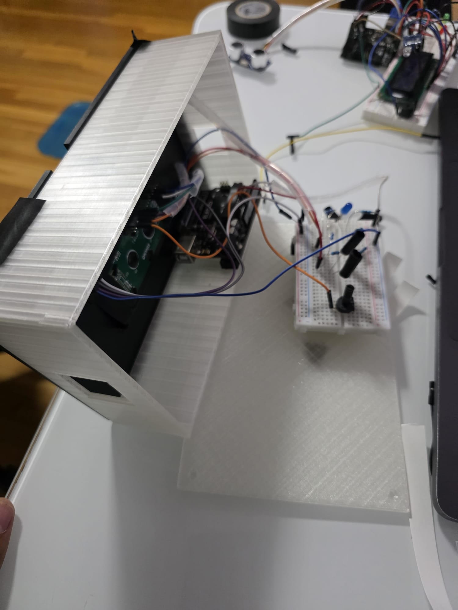
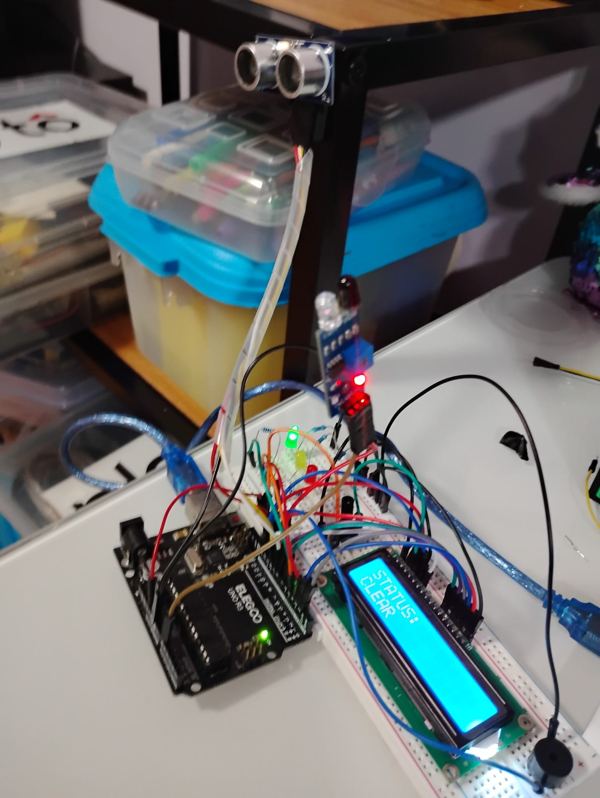
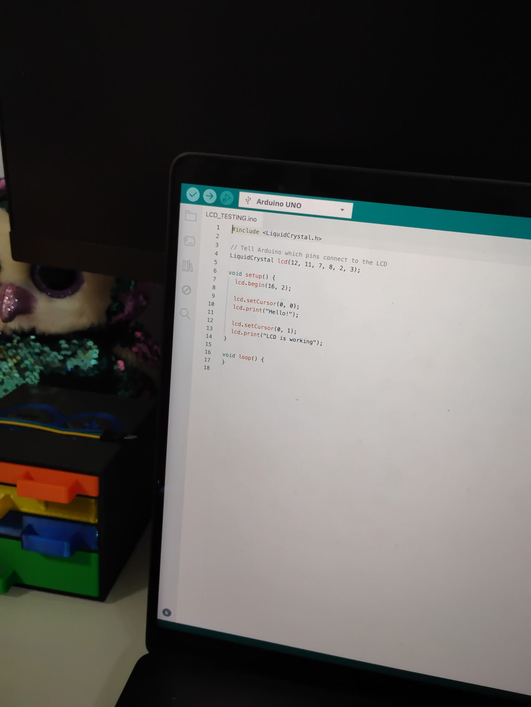

# HACKCLUB_WARMUPPROJECT

This is the first-ever hardware project that I will be making! I am using an Arduino Uno R3, some LEDs, a Breadboard, resistors, and an ultrasonic sensor. I am making a sensor detection system that can be implemented in real life for sidewalks where there are traffic lights. The traffic lights will be red, yellow, or green according to the ultrasonic sensor. If the ultra sonic sensor detects something coming towards the crosswalk(human) that is 21 cm or more away(for this model), it will turn the traffic light yellow. 
This is the traffic LIght project for the warm up 

Adding Hardware in 3D model First image 

For this image I was doing a test for the LCD dispaly to dispaly text based on the color of the LEDS!

In this image, I am coding on Arduino IDE for the LCD to dispaly a smaple text of "Hi" 

